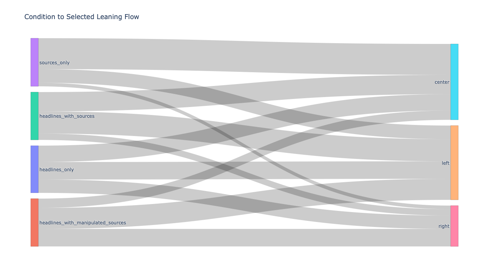

# Sourcerers: Source-Selection Robustness in LLMs

[](https://llm-news-bias-analysis.streamlit.app)
[](https://sourcerers-analytics-api.onrender.com/docs)
[](https://github.com/amirhossein-razlighi/LLM-News-Bias-Analysis/actions/workflows/ci.yml)
[](https://github.com/amirhossein-razlighi/LLM-News-Bias-Analysis/actions/workflows/docs.yml)
[](https://amirhossein-razlighi.github.io/LLM-News-Bias-Analysis/)

A reproducible NLP experimentation framework for analyzing how LLMs choose among politically diverse news sources under controlled prompt conditions.

This repository supports:

- Offline incident preparation from real news JSON files.
- Condition-controlled prompt construction for source-selection experiments.
- Multi-model evaluation via local Ollama models.
- Analytics through Streamlit and FastAPI.
- Report-ready artifacts (plots + summary tables) generated from saved runs.

## 1) Why This Project Exists

Modern LLMs can appear neutral while still exhibiting selection bias, source-identity overreliance, or prompt-format sensitivity. This project tests those risks directly by asking models to choose one article from left/center/right candidates across multiple controlled conditions.

Core research intent:

- Measure robustness of model choices when source labels are manipulated.
- Compare inter-model behavior under identical candidate sets.
- Track reliability signals such as parse stability and latency.

## 2) Project Scope And Pipeline

### Input Data

- Real incidents are built from JSON articles in data/jsons.
- The preparation step groups topic-level incidents that include left, center, and right coverage.

### Experimental Conditions

- headlines_only
- headlines_with_sources
- sources_only
- headlines_with_manipulated_sources

These conditions isolate content effects vs source-identity effects.

### Output Artifacts Per Run

Each run folder in outputs/run_YYYYMMDD_HHMMSS includes:

- experiment_requests.jsonl
- model_decisions.jsonl
- raw_outputs.jsonl

These files are enough to fully reproduce downstream analytics and plots.

## 3) Repository Structure (Key Files)

- dashboard.py: Streamlit interface for analytics and experiment execution.
- app/cli/prepare_real_incidents.py: Converts raw article JSON data into experiment-ready incidents.
- app/cli/run_experiments.py: Runs condition/model combinations and writes run artifacts.
- app/cli/generate_report_assets.py: Builds report plots and summary tables from outputs.
- app/cli/generate_llm_dashboard_summary.py: Generates a saved LLM executive summary JSON for the dashboard (offline, via Ollama).
- app/api/engine_analytics.py: Ingestion + metrics engine used by API and dashboard.
- configs/models.example.yaml: Manifest of Ollama models and decoding params.
- docs/figures/: Generated report assets (plots and summary metrics).

## 4) Quickstart (Reproducible)

### Prerequisites

- Python 3.10
- Ollama installed locally
- uv package manager

### Setup

```bash
uv venv --python 3.10
uv sync
```

### Pull Models (example)

```bash
ollama pull qwen2.5:7b
ollama pull qwen3:8b
ollama pull gemma3:4b
```

### Start Ollama

```bash
ollama serve
```

### Run Dashboard

```bash
uv run streamlit run dashboard.py
```

### Run Tests

```bash
uv run pytest -q
```

## 5) End-To-End CLI Workflow

### A. Prepare incidents from raw JSON

```bash
uv run python -m app.cli.prepare_real_incidents \
  --json-dir data/jsons \
  --output data/real_incidents_all.jsonl \
  --min-per-leaning 3 \
  --max-articles-per-leaning 8
```

### B. Run experiments

```bash
uv run python -m app.cli.run_experiments \
  --input data/real_incidents_all.jsonl \
  --models-manifest configs/models.example.yaml \
  --output-dir outputs \
  --conditions headlines_only headlines_with_sources sources_only headlines_with_manipulated_sources \
  --max-combinations 3 \
  --seed 42
```

### C. Generate report assets from saved outputs

```bash
uv run python -m app.cli.generate_report_assets \
  --outputs-dir outputs \
  --assets-dir docs/figures
```

### D. Generate offline LLM executive summary for dashboard

```bash
uv run python -m app.cli.generate_llm_dashboard_summary \
  --outputs-dir outputs \
  --model gemma4:latest \
  --summary-json outputs/llm_dashboard_summary.json
```

This writes a reusable summary file that the dashboard shows in the top "✨ LLM Summary" section.

### E. Build technical documentation site

```bash
uv sync --group docs
uv run mkdocs serve
```

Static build check:

```bash
uv run mkdocs build --strict
```

The documentation site includes architecture, usage guides, and auto-generated API reference from source modules via mkdocstrings.
GitHub Pages publishing is automated by `.github/workflows/docs.yml`.

## 6) Evaluation Protocol

### Main Evaluation Signals

- Parse reliability: success/fallback/failure rates from structured response parsing. (Strict JSON)
- Latency: mean and p95 latency per model.
- Selection distribution: left/center/right choice ratios.
- Robustness proxy: sensitivity to manipulated source labels.
- Position effect signal: selected candidate index distribution.
- Counterfactual label sensitivity: change rate between real-source vs swapped-source conditions.
- Cross-model agreement and instability: entropy-based disagreement across models on the same incident.

### Baseline Included

The report assets include a candidate-mix random baseline for center selection:

- Baseline center rate = mean proportion of center candidates offered to the model.
- Model center selection rates are compared against this baseline.

This baseline is simple but useful to detect models selecting center above or below chance given candidate availability.

## 7) Current Empirical Snapshot (From outputs/)

Generated from existing run artifacts in this repository using app/cli/generate_report_assets.py.

### Dataset coverage in current snapshot

- Decisions: 9312
- Runs: 6
- Models: 7
- Conditions: 4

### Aggregate parser health

- Parse success: 84.91%
- Parse failure: 14.74%

### Model summary table

| model | n | parse_success_rate | parse_fallback_rate | parse_failure_rate | avg_latency_ms | p95_latency_ms | center_selection_rate |
| --- | --- | --- | --- | --- | --- | --- | --- |
| qwen2.5:7b | 1344 | 99.93% | 0.00% | 0.07% | 11668 | 14992 | 38.35% |
| qwen3:8b | 1344 | 99.93% | 0.00% | 0.07% | 9494 | 11139 | 30.68% |
| mistral:latest | 1248 | 99.60% | 0.00% | 0.40% | 3036 | 3576 | 49.32% |
| gemma3:4b | 1344 | 99.33% | 0.00% | 0.67% | 5964 | 6831 | 40.97% |
| phi4-mini:3.8b | 1344 | 96.58% | 2.38% | 1.04% | 2189 | 2717 | 37.22% |
| llama3.2:3b | 1344 | 92.93% | 0.00% | 7.07% | 1572 | 1993 | 41.15% |
| gemma4:latest | 1344 | 7.14% | 0.00% | 92.86% | 2906 | 3490 | 50.00% |

## 8) Generated Figures

### Parse reliability by model


### Latency by model (average and p95)


### Selection mix by condition


### Center delta heatmap (model x condition)


### Reliability-speed Pareto (bubble = instability)


### Parse reliability calibration


### Center selection vs baseline


### Condition to selected-leaning Sankey (interactive)

- [Open interactive Sankey](docs/figures/condition_to_bucket_sankey.html)

Sankey flow snapshot (counts extracted from the generated interactive figure):

| condition | to_left | to_center | to_right | total |
| --- | --- | --- | --- | --- |
| headlines_only | 833 | 779 | 636 | 2248 |
| headlines_with_manipulated_sources | 1000 | 442 | 834 | 2276 |
| headlines_with_sources | 1054 | 919 | 303 | 2276 |
| sources_only | 648 | 1471 | 171 | 2290 |



### Additional generated analysis assets

- [Counterfactual effects table](docs/figures/counterfactual_effects.md)
- [Cross-model agreement table](docs/figures/cross_model_agreement.md)
- [Failure taxonomy table](docs/figures/failure_taxonomy.md)
- [Model instability table](docs/figures/model_instability.md)
- [Qualitative error examples](docs/figures/qualitative_errors.md)

#### Counterfactual effects (inline)

| model | n_pairs | label_sensitivity_rate | ci95_low | ci95_high |
| --- | --- | --- | --- | --- |
| llama3.2:3b | 298 | 0.5268456375838926 | 0.47315436241610737 | 0.5838926174496645 |
| mistral:latest | 310 | 0.5258064516129032 | 0.46766129032258064 | 0.5806451612903226 |
| gemma3:4b | 332 | 0.5030120481927711 | 0.44879518072289154 | 0.5572289156626506 |
| qwen2.5:7b | 335 | 0.4955223880597015 | 0.4417910447761194 | 0.5492537313432836 |
| gemma4:latest | 311 | 0.4212218649517685 | 0.3664790996784566 | 0.47596463022508034 |
| phi4-mini:3.8b | 330 | 0.41515151515151516 | 0.3606060606060606 | 0.4636363636363636 |
| qwen3:8b | 336 | 0.40476190476190477 | 0.3482142857142857 | 0.45535714285714285 |

#### Cross-model agreement (inline)

| condition | n_groups | mean_agreement_rate | mean_normalized_entropy | instability_score |
| --- | --- | --- | --- | --- |
| headlines_only | 424 | 0.6409946840371369 | 0.6328563709804557 | 0.6328563709804557 |
| headlines_with_manipulated_sources | 424 | 0.6239845387840671 | 0.6542016926693891 | 0.6542016926693891 |
| headlines_with_sources | 424 | 0.654039383048817 | 0.6167524886152344 | 0.6167524886152344 |
| sources_only | 424 | 0.7438978736148548 | 0.4654712053731028 | 0.4654712053731028 |

#### Failure taxonomy (inline)

| model | parse_status | error_category | count | ratio_within_model |
| --- | --- | --- | --- | --- |
| gemma3:4b | success | other | 1335 | 0.9933035714285714 |
| gemma3:4b | failed | invalid_or_missing_selected_article_id | 9 | 0.006696428571428571 |
| gemma4:latest | success | other | 1247 | 0.999198717948718 |
| gemma4:latest | failed | invalid_or_missing_selected_article_id | 1 | 0.0008012820512820513 |
| llama3.2:3b | success | other | 1249 | 0.9293154761904762 |
| llama3.2:3b | failed | invalid_or_missing_selected_article_id | 95 | 0.07068452380952381 |
| mistral:latest | success | other | 1243 | 0.9959935897435898 |
| mistral:latest | failed | invalid_or_missing_selected_article_id | 5 | 0.004006410256410256 |
| phi4-mini:3.8b | success | other | 1298 | 0.9657738095238095 |
| phi4-mini:3.8b | fallback | fallback_after_malformed_json | 32 | 0.023809523809523808 |
| phi4-mini:3.8b | failed | invalid_or_missing_selected_article_id | 14 | 0.010416666666666666 |
| qwen2.5:7b | success | other | 1343 | 0.9992559523809523 |
| qwen2.5:7b | failed | other | 1 | 0.000744047619047619 |
| qwen3:8b | success | other | 1343 | 0.9992559523809523 |
| qwen3:8b | failed | invalid_or_missing_selected_article_id | 1 | 0.000744047619047619 |

#### Model instability (inline)

| model | n_incidents | instability_score |
| --- | --- | --- |
| qwen2.5:7b | 112 | 0.6279761904761906 |
| llama3.2:3b | 112 | 0.625 |
| phi4-mini:3.8b | 112 | 0.6190476190476192 |
| gemma3:4b | 112 | 0.6130952380952381 |
| qwen3:8b | 112 | 0.6101190476190476 |
| mistral:latest | 104 | 0.592948717948718 |
| gemma4:latest | 104 | 0.5576923076923077 |

#### Qualitative error examples (inline)

Preview excerpt from generated qualitative errors:

```text
run_20260416_171758 | qwen3:8b | headlines_only | topic_fake_news | failed | selected_article_id missing or not in candidates
response: {"selected_article_id": "7JFQGvJ0LKQOMe0t", "reason": "Offers a proactive approach to combating fake news."}

run_20260416_171758 | gemma3:4b | headlines_with_manipulated_sources | topic_technology | failed | selected_article_id missing or not in candidates
response: {"selected_article_id": "0xcOUPRRvmYf5mX1H", "reason": "This article discusses the potential role of big tech in radicalization ..."}

run_20260416_171758 | gemma3:4b | headlines_with_sources | topic_us_house | failed | selected_article_id missing or not in candidates
response: {"selected_article_id": "3", "reason": "The article from Vox provides a good overview of the situation ..."}

run_20260416_171758 | gemma3:4b | headlines_only | topic_epa | failed | selected_article_id missing or not in candidates
response: {"selected_article_id": "3", "reason": "The article detailing the Executive action to kill the Clean Power Plan ..."}

run_20260416_171758 | gemma3:4b | headlines_only | topic_business | failed | selected_article_id missing or not in candidates
response: {"selected_article_id": "1", "reason": "This article discusses a major leadership change at PepsiCo ..."}
```

## 9) FastAPI Analytics (Optional)

Run API locally:

```bash
uv run uvicorn app.api.engine_analytics:app --host 0.0.0.0 --port 8000 --reload
```

Useful endpoints:

- GET /metrics/inter-model
- GET /metrics/summary
- GET /metrics/conditions-by-model
- GET /metrics/compare-runs?run_a=...&run_b=...
- POST /ingest/run
- POST /ingest/runs

Docs:

- <http://127.0.0.1:8000/docs>
- <http://127.0.0.1:8000/redoc>

## 10) CI (GitHub Actions)

This repository includes a reliability-focused CI pipeline under .github/workflows.

### CI workflow

File: .github/workflows/ci.yml

Runs on every push to main and on pull requests. It enforces reliability by:

- Installing dependencies with uv in a clean environment.
- Running the test suite.
- Regenerating analytics artifacts from outputs.
- Validating summary.json schema and metric ranges.
- Validating generated report artifacts (summary table, qualitative errors, limitations).
- Uploading report assets as a workflow artifact.

## 11) Streamlit Dashboard Publishing

If you publish dashboard.py via Streamlit Community Cloud:

- Keep dashboard.py as the app entrypoint.
- Point Streamlit Cloud to this repository.
- Use requirements.txt for dependency installation.

Live app:

- [LLM News Bias Analysis Streamlit app](https://llm-news-bias-analysis.streamlit.app)

## 12) Public FastAPI Deployment

The analytics API can be published separately so others can access your metrics endpoints.

### Option A: Render (recommended quick path)

This repo includes render.yaml for one-click web service deployment.

Live API base URL:

- [Sourcerers Analytics API](https://sourcerers-analytics-api.onrender.com/)

Steps:

1. Connect this repository in Render.
2. Select Blueprint deploy (it will read render.yaml).
3. After deploy, use:

- [Swagger UI](https://sourcerers-analytics-api.onrender.com/docs)
- [ReDoc](https://sourcerers-analytics-api.onrender.com/redoc)

1. Optional safety defaults already set in render.yaml:

- ENABLE_ANALYTICS_WRITE_ENDPOINTS=0
- API_ALLOW_ORIGINS=*

### Option B: Any container/PaaS

Run the same API command with platform port binding:

```bash
uvicorn app.api.engine_analytics:app --host 0.0.0.0 --port $PORT
```

Useful public endpoints:

- GET /metrics/summary
- GET /metrics/inter-model
- GET /metrics/conditions-by-model

## 13) Reproducibility Freeze

Final reporting now supports reproducibility metadata using:

- Frozen manifest: configs/models.final.yaml
- Frozen seed: 42

Generate enriched report assets (with confidence intervals, qualitative error samples, and limitations):

```bash
uv run python -m app.cli.generate_report_assets \
  --outputs-dir outputs \
  --assets-dir docs/figures \
  --frozen-manifest configs/models.final.yaml \
  --frozen-seed 42
```
